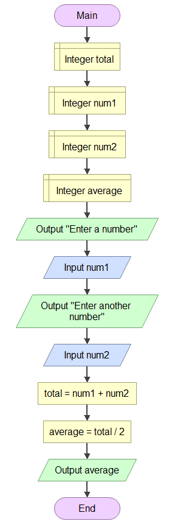
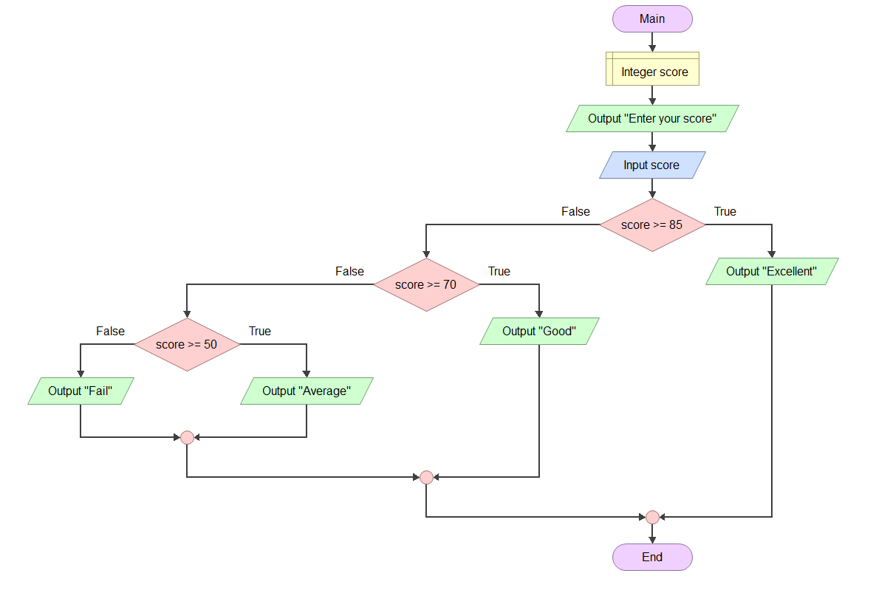

# 9CT Assessment Task 1
### By Evelyn Starling
***

## Requirements Outline
###  Functional Requirements
+  Defining the Purpose
    + I need to create a program for the EV3 MINDSTORMS robot to allow it to transport a red block and a yellow block to designated positions while avoiding the other blocks.
+ Identify Key Actions
    + Object Detection: Move forward until an object is detected
        + Use Case: The robot is moving forward and detects an obstacle. The ultrasonic sensor detects an object within 10 cm. The robot stops and turns 45° to avoid the obstacle. The robot avoids the obstacle and continues its path.
    + Colour Check: Check the colour; if it is yellow or red, capture
        + Use Case: The robot is moving forward and detects an obstacle. The colour sensor checks whether the object is yellow or red. If it is, the robot captures the block. The robot successfully captures the correct colour.
    + Return: The robot returns the box back to the specified area
        + The robot has captured the box. As it moves back to the specified area, it uses the ultrasonic sensor to check for obstacles. If it comes across an obstacle, it turns 45°. The robot successfully takes the box back home.
+ Test Cases
    + | Test Case | Input     | Expected Output   |
      |---------- |---------- |----------------   |
      |Avoids Obstacle|Ultrasonic sensor detects an object within 10cm|The robot turns 45° to avoid the obstacle|
      |Checks Colour|Colour sensor detects that an obstacle is yellow or red|The robot captures the box|
      |Returns|The box has been captured and 'avoids obstacles' has been performed again|The box is successfully returned|
### Non-Functional Requirements
As well as completing the above requirements, the robot should react to the ultrasonic sensor's inputs within 2 seconds to prevent it from crashing into an object, complete the task with a moderate level of efficiency (it shouldn't take hours to get the blocks), and accurately skewer the blocks and drag them back to the starting area.
***

## Design
### Pseudocode (Warmup Activities)
+ ACTIVITY 1A
~~~~
BEGIN
INPUT number
IF number % 2 == 0 THEN
    DISPLAY "even number"
ELSE
    DISPLAY "odd number"
ENDIF
END
~~~~
+ ACTIVITY 1B
~~~~
BEGIN
INPUT i
IF i = 1; i <= a; i++ THEN
    f = f*i
ENDIF
PRINT f
END
~~~~
+ ACTIVITY 2A
~~~~
BEGIN
WHILE price != done
    INPUT price
    total = total + price
ENDWHILE
IF total > 100 THEN
    total = total + total * 10%
ENDIF
PRINT total
END
~~~~
+ ACTIVITY 2B
~~~~
BEGIN
INPUT n
FOR i IN n
    Set total to total + 1
ENDFOR
PRINT total
~~~~
### Flowcharts (Warmup Activities)

## Development and Integration
***
### Testing and Debugging
### Test case - colour detection
Aim: for the robot to follow the black line
- #### Failure Of The Colour Sensor
    Upon starting to test our programs, we realised the colour sensor was not functioning (and unusable). We attempted to make the EV3 follow the black line; which would either cause the robot to collide with obstacles, or leave the mat. We then attempted moving the colour sensor, rebuilding the robot various times, but most of these interfered with the results (e.g, underneath and near the front). After performing many tests and changing as much as we could, we realised that it was unrealistic  to use the colour sensor. In the end, we chose to scrap the colour sensor altogether.

Evaluation: failed, but we were able to move past the step

### Test case - avoiding obstacles
Aim: for the robot to accurately move along the mat, avoiding the blue and green boxes
- #### Hard Code/Measuring
   After the sensors had failed through all our tests, we made the decision to hard code the EV3. Although it wasn't the most efficient in the program, it was functional, which was our main priority. However, hard coding the robot was still tricky; the measurements were always slightly off and we spent quite a while trying to get angles and distances correct.

Evaluation: tedious, but successful

### Test case - capturing boxes
Aim: for the robot to successfully collect the red and yellow blocks while avoiding the blue and green
- #### Developing The First Grabber
    While Emma and I worked on hard coding the robot to move around the mat, Juliet was chosen to create the grabber; as we decided against just piercing the blocks. This grabber was the first of three designs. Design #1 featured a one sided grabber intended to catch the block and funnel it toward the centre. It was shaped similarly to half a hexagon.

- #### Developing The Second Grabber
    Similarly to Design #1, the funnel was on one side of the robot. However, this grabber stuck outwards more, and was straighter. This ensured that the second block would stay within the grabber whilst the EV3 turned. While this grabber was generally successful,  it was mistakenly disassembled at the end of the lesson.

- #### Developing The Final Grabber
    The 'stag beetle' was our third and final grabber design. It had two, long lego technic blocks reaching out ahead of it, giving it its name. This grabber was long enough, grabbed the blocks, and held them in place.

Evaluation: although it took a few lessons, our final design was very functional

### Test case - beginning the program
Aim: to begin the problem by pressing the button on the touch sensor
- #### Implementing The Touch Sensor
    As our code required the use of two sensors, using the touch sensor was vital. While Emma and I were hard coding yet again, Juliet worked on programming the touch sensor. This, thankfully, worked immediately!

Evaluation: worked perfectly on the first try

## Evaluation
***